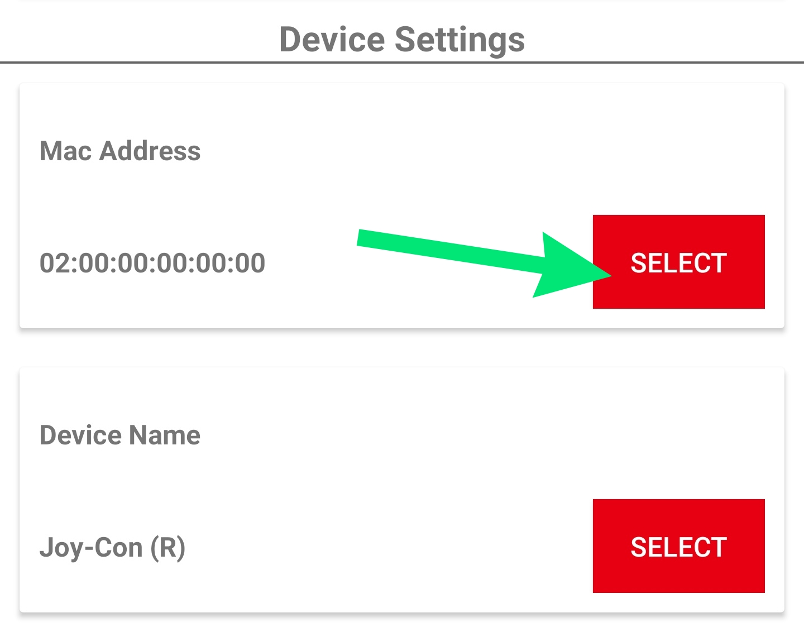

# Connecting to Your Switch

After making sure your device is [compatible](../compatibility.md), it is time to connect to the Switch! For basic gamepad compatibility (not including amiibo), you need to at least have [support for Bluetooth HID Profiles](../other-projects/bluetooth-hid-profile-tester.md) and have already changed your Device Class to `002508`using the [Bluetooth++](bluetoothpp.md) Magisk module **or** by changing your MAC address using root.

[Main Connection Guide](connecting-to-your-switch.md#steps-to-connect)

[Disconnection Problem Fix](connecting-to-your-switch.md#if-joycon-droid-disconnects-from-the-switch-after-leaving-the-change-grip-order-screen)

[amiibo workaround](connecting-to-your-switch.md#real-left-joy-con-right-joycon-for-amiibo)


Latest JoyCon Droid APK Download



## Important!

When opening JoyCon Droid for the first time, allow the following permissions when requested or else the app won't function correctly:



## **Steps to connect:**  

## 1) Save your **Android's** Bluetooth MAC Address in JoyCon Droid.  

#### This step is technically optional. However, it is very necessary for a better and automatic reconnection to the Switch for certain menus and games. The first time you choose a controller in JoyCon Droid, you will be asked for your Android's Bluetooth MAC Address. 

.png>)

#### If you skip this, you can also find it in JoyCon Droid Settings later:

#### First make sure that Bluetooth is turned on:

.png>)

#### To find your Android's Bluetooth MAC address, go to the Settings app of your phone and scroll down to **About phone.**

.png>)

#### After opening About phone, scroll down to **Bluetooth address.**

.png>)

#### Now copy and paste or manually enter your Bluetooth address into JoyCon Droid and then tap Set.

.png>)

## 2) Choose your controller in JoyCon Droid and Allow it to turn on Bluetooth for you if it’s not already on.

.png>)

.png>)

## 3) Tap Allow when asked to make your phone visible to other Bluetooth devices for 60 seconds

.png>)

## 4) On your Switch, go to Controllers → Change Grip/Order. 

.png>)

.png>)

.png>)

## 5) Tap Pair when the Switch pairing request appears.

#### If you don't see this Pair request, tap the sync button once:

.png>)

.png>)

.png>)

## 6) After Pairing, your controller should appear on the Switch. If you're using a single JoyCon, you'll need to press SL and SR together first.

.png>)

.png>)

.png>)

## 7) Continue and you should now be connected! 

.png>)

***

## If your Switch asks you to update controller, don't do it! Press Later. 

.png>)

***

## **To disconnect your controller or select a different one, use the notification in the Status Bar or turn off Bluetooth:**

.png>)

***

## **If JoyCon Droid disconnects from the Switch after leaving the Change Grip/Order Screen:** 

.png>)

### You must connect with the following workaround if this is happening: 

Before continuing, you may need to disconnect your chosen controller by using the status bar notification and leave the Change Grip/Order screen, turn off Bluetooth on your phone **or** restart both your Android and Switch console.

### 1) Follow steps 1 through 4 from [above](connecting-to-your-switch.md#steps-to-connect), don't skip step 1.

### 2) When you get the Pairing Request, WAIT! Don't press Pair yet!

.png>)

## 3) Exit the Change/Grip Order screen using the Back button. You can press the Back button in handheld mode with your finger: 

.png>)

## 4) Now you can tap Pair on your Android.

.png>)

## 5) The controller should now be connected on the Controllers screen! You can Close this screen. 

.png>)

***

## Real Left Joy-Con + Right JoyCon for amiibo 

Using a combination of a **REAL Left Joy-Con** and a **Right JoyCon from JoyCon Droid** can increase your success of using amiibos. It might also make the connection process more stable in general. You may also need to change the Packet Rate in JoyCon Droid Settings. Different devices will have varying rates of success using packet rates such as 10, 20, 50, 69, 120 pps, etc.

.png>)

### 1) Make sure you have done steps 1 through 5 from the [top of this page](connecting-to-your-switch.md#steps-to-connect). 

### 2) Pair your REAL Left JoyCon. You might need to first hold down the sync button on the side. 

### 3) If your Left JoyCon and Right JoyCon (from JoyCon Droid) are paired, you should see this: 

.png>)

### 4) Now hold L+R together. (L on your REAL Left Joy-Con and R on the _JoyCon Droid_ Right JoyCon and they will combine: 

.png>)

### 5) Now they are connected and paired:

.png>)

Note: Having a real controller connected wirelessly to the Switch, such as a Joy-Con, at the same time as JoyCon Droid can make the connection more stable in general for both amiibo and the connecting process (especially on games that disconnect controllers at start). You do not necessarily HAVE to use the Right JoyCon from the app, the Pro Controller from the app can work with this method too.

### Make sure to try changing your packet rate and testing other amiibos in JoyCon Droid Settings if this didn't work. 

### Now you can try [using amiibos](using-amiibo.md)!
